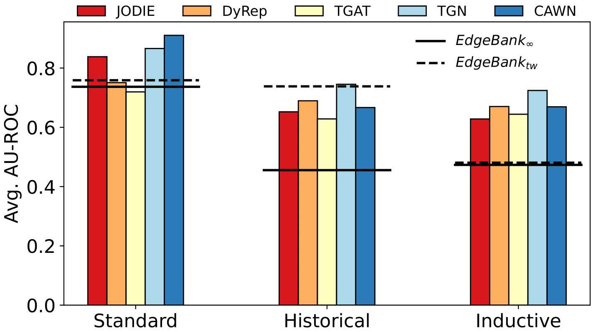

# Towards Better Evaluation for Dynamic Link Prediction


## Introduction

Despite the prevalence of recent success in learning from static graphs, learning from time-evolving graphs remains an open challenge. In this work, we design new, more stringent evaluation procedures for link prediction specific to dynamic graphs, which reflect real-world considerations, to better compare the strengths and weaknesses of methods. First, we create two visualization techniques to understand the reoccurring patterns of edges over time and show that many edges reoccur at later time steps. Based on this observation, we propose a pure memorization baseline called EdgeBank. EdgeBank achieves surprisingly strong performance across multiple settings because easy negative edges are often used in current evaluation setting. To evaluate against more difficult negative edges, we introduce two more challenging negative sampling strategies that improve robustness and better match real-world applications. Lastly, we introduce six new dynamic graph datasets from a diverse set of domains missing from current benchmarks, providing new challenges and opportunities for future research.



The ranking of different methods changes in the proposed negative sampling settings which contains more difficult negative edges. Our proposed baselines (horizontal lines) show competitive performance, in particular in standard setup. 


## Running the experiments

### Requirements
* `python >= 3.7`, `PyTorch >= 1.4`
* Other requirements:

```{bash}
pandas==1.1.0
scikit_learn==0.23.1
tqdm==4.41.1
numpy==1.16.4
matploblib==3.3.1
```

#### Datasets and Processing
All dynamic graph datasets can be downloaded from [here](https://zenodo.org/record/7008205#.YxtIwi0r1hC).
Then, they can be located in *"DG_data"* folder.
For conducting any experiments, the required data should be in the **data** folder under each model of interest.
* For example, to train a *TGN* model on *Wikipedia* dataset, we can use the following command to move the edgelist to the right folder:
```{bash}
cp DG_data/wikipedia.csv tgn/data/wikipedia.csv
```

* Then, the edgelist should be pre-processed to have the right format.
Considering the example of *Wikipedia* edgelist, we can use the following command for pre-processing the dataset:
```{bash}
# JODIE, DyRep, or TGN
python tgn/utils/preprocess_data.py --data wikipedia

# TGAT
python tgat/preprocess_data.py --data wikipedia

# CAWN
python CAW/preprocess_data.py --data wikipedia
```


### Model Training
* Example of training different graph representation learning models on *Wikipedia* dataset:
```{bash}
data=wikipedia
n_runs=5

# JODIE
method=jodie
prefix="${method}_rnn"
python tgn/train_self_supervised.py -d $data --use_memory --memory_updater rnn --embedding_module time --prefix "$prefix" --n_runs "$n_runs" --gpu 0

# DyRep
method=dyrep
prefix="${method}_rnn"
python tgn/train_self_supervised.py -d "$data" --use_memory --memory_updater rnn --dyrep --use_destination_embedding_in_message --prefix "$prefix" --n_runs "$n_runs" --gpu 0

# TGN
method=tgn
prefix="${method}_attn"
python tgn/train_self_supervised.py -d $data --use_memory --prefix "$prefix" --n_runs "$n_runs" --gpu 0

# TGAT
prefix="TGAT"
python -u tgat/learn_edge.py -d $data --bs 200 --uniform --n_degree 20 --agg_method attn --attn_mode prod --gpu 0 --n_head 2 --prefix $prefix --n_runs $n_runs --gpu 0

# CAWN
python CAW/main.py -d $data --pos_dim 108 --bs 32 --n_degree 64 1 --mode i --bias 1e-5 --pos_enc lp --walk_pool sum --seed 0 --n_runs "$n_runs" --gpu 0

```

* Example of using EdgeBank for dynamic link prediction with standard *random* negative sampler:
```{bash}
data=Wikipedia
mem_mode=unlim_mem
n_runs=5
neg_sample=rnd  # can be one of these options: "rnd": standard randome, "hist_nre": Historical NS, or "induc_nre": Inductive NS
python EdgeBank/link_pred/edge_bank_baseline.py --data "$data" --mem_mode "$mem_mode" --n_runs "$n_runs" --neg_sample "$neg_sample"
```

### Testing Trained Models
* Testing trained models with different negative edge sampling strategies:
```{bash}
n_runs=5
data=wikipedia
neg_sample=hist_nre  # can be either "hist_nre" for historical NS, or "induc_nre" for inductive NS

# JODIE
method=jodie
python tgn/tgn_test_trained_model_self_sup.py -d "$data" --use_memory --memory_updater rnn --embedding_module time --model $method --neg_sample $neg_sample --n_runs $n_runs --gpu 0

# DyRep
method=dyrep
python tgn/tgn_test_trained_model_self_sup.py -d "$data" --use_memory --memory_updater rnn --dyrep --use_destination_embedding_in_message --model $method --neg_sample $neg_sample --n_runs $n_runs --gpu 0

# TGN
method=tgn
python tgn/tgn_test_trained_model_self_sup.py -d $data --use_memory --model $method --neg_sample $neg_sample --n_runs $n_runs --gpu 0

# TGAT
prefix="TGAT"
python tgat/tgat_test_trained_model_learn_edge.py -d $data --uniform --n_degree 20 --agg_method attn --attn_mode prod --gpu 0 --n_head 2 --prefix $prefix --n_runs $n_runs --neg_sample $neg_sample

# CAWN
python CAW/caw_test_trained_model_main.py -d $data --pos_dim 108 --bs 32 --n_degree 64 1 --mode i --bias 1e-5 --pos_enc lp --walk_pool sum --seed 0 --n_runs "$n_runs" --gpu 0 --neg_sample $neg_sample

```

### Visualizing Dynamic Graphs
For visualizing the dynamic networks, their edgelists should be located in the *"visualization/data/"* folder.

* For generating **_TEA_** plots:
```{bash}
python visualization/TEA_plots.py
```
(Different networks can be selected directly in the *"visualization/TEA_plots.py"* file.)

* For generating **_TET_** plots:
```{bash}
python visualization/TET_plots.py
```
(Different networks can be selected directly in the *"visualization/TET_plots.py"* file.)

The outputs are saved in *"visualization/figs/TEA"* or *"visualization/figs/TET"* folder for the *TEA* or *TET* plots, respectively.


### Maintenance Plan
Since investigation of temporal graphs has significant impacts on several domains, we plan to develop and extend this project in several ways.
In particular, we plan on the following directions:
* Including more tem temporal graph datasets from even larger selection of domains; e.g. biological, chemical graphs, etc.
* Including additional temporal graph learning methods as they become available.
* Including inductive link prediction settings.


### Acknowledgment
We would like to thank the authors of [TGAT](https://github.com/StatsDLMathsRecomSys/Inductive-representation-learning-on-temporal-graphs), [TGN](https://github.com/twitter-research/tgn), and [CAWN](https://github.com/snap-stanford/CAW) projects for providing access to their projects' code.

